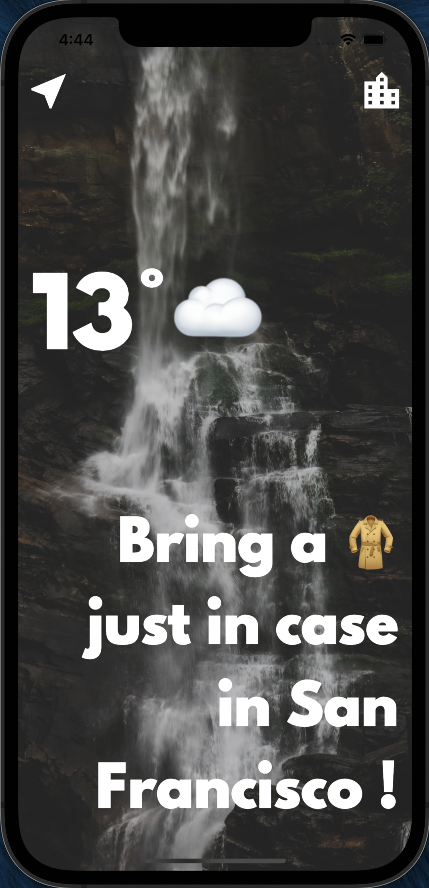
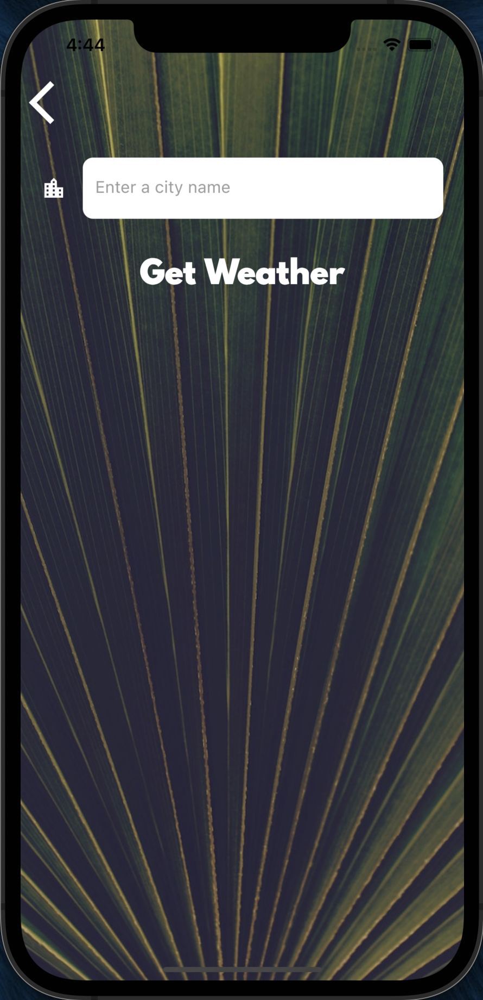

# Clima

A simple weather application realized with Flutter.

It uses API Rest ressources from OpenWeatherMap and location service.

This app comes from Angela YU's tutorial : [Flutter Development Bootcamp with Dart](https://www.udemy.com/course/flutter-bootcamp-with-dart/)

 
